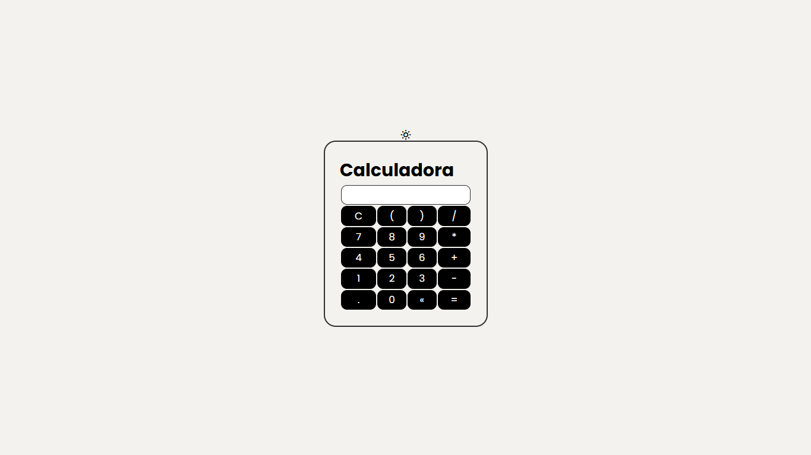
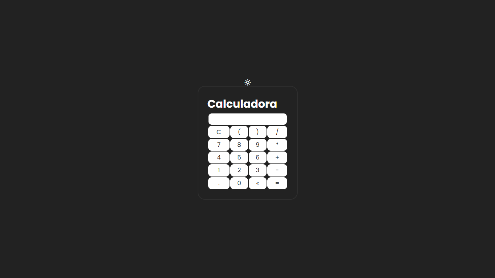

# Valculadora v2

Calculadora v2 é um projeto simples e funcional que permite realizar operações matemáticas básicas de maneira prática e direta. O objetivo é oferecer uma solução intuitiva e acessível para cálculos rápidos no dia a dia.

## Índice

- [Visão Geral](#visão-geral)
  - [Imagens](#Imagens)
- [Funcionalidades](#funcionalidades)
- [Tecnologias Utilizadas](#tecnologias-utilizadas)
- [Começando](#começando)
  - [Instalação](#instalação)
- [Contribuindo](#contribuindo)
- [Contato](#contato)

## Visão Geral

Este projeto foi desenvolvido para simplificar o uso de uma calculadora, com uma interface amigável e fácil de usar. Ideal para estudantes, profissionais ou qualquer pessoa que precise realizar cálculos básicos de forma eficiente.

[Calculadora-v2](https://github.com/DalioSY/calculadora-v2)

## Imagens

Aqui estão algumas imagens do projeto:

<div>
    
    
</div>

## Funcionalidades

- Adição, subtração, multiplicação e divisão.
- Interface limpa e intuitiva.

## Tecnologias Utilizadas

- HTML
- CSS
- JavaScript

## Começando

### Instalação

1. Clone este repositório

```bash
git clone https://github.com/DalioSY/calculadora-v2.git
```

2. Acesse a pasta do projeto

```bash
cd calculadora-v2
```

## Contribuindo

Contribuições são bem-vindas! Se você tiver sugestões de melhorias ou encontrar algum bug, sinta-se à vontade para abrir uma issue ou submeter um pull request.

## Contato

- **Dalio Shindi Yamada**
- [GitHub](https://github.com/DalioSY)
- [LinkedIn](https://www.linkedin.com/in/dalio-s-yamada)
- [Portfólio](https://portfolio-dalio.vercel.app/)